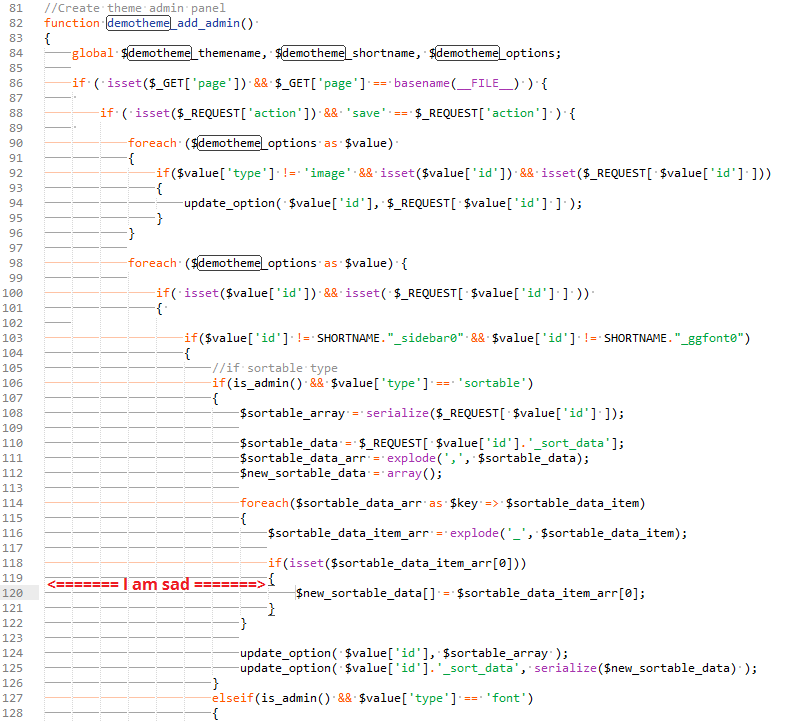
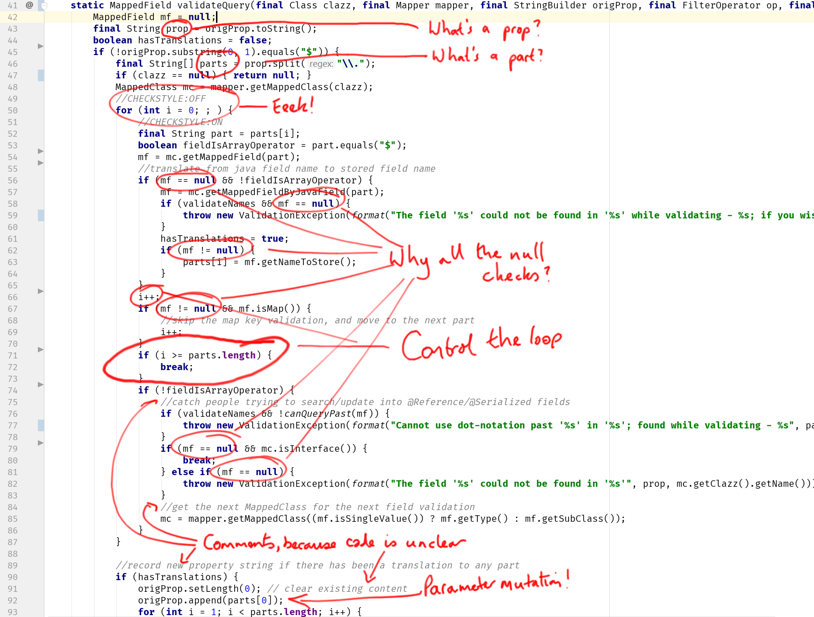
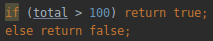

# LPOO - REFACTORING
### Aula dada na Plataforma Slack por Hugo Sereno Ferreira  - 31-03-2020

[This week’s exercises](https://web.fe.up.pt/~arestivo/page/exercises/refactoring/)

Vamos então começar a aula… Hoje é sobre “code smells” e refactorings. Os exercícios estão lá em cima, como sempre.

Antes de começarmos a bater código como malucos (até porque não é bem esse o objectivo). É preciso percebermos que estamos ainda na mesma linha dos últimos tempos. O código funciona? funciona. mas mesmo assim não gostamos dele. (telefone) continuando, já foram dados padrões, já foram dados princípios de SOLID. todos eles tentam alguma coisa; claramente não é fazer o código funcionar (porque há partida já funciona) e vcs já disseram várias vezes o que estamos a tentar melhorar. acima de tudo, a “performance” só que não da máquina mas sim do utilizador; isto porque sabemos (e vcs no quarto ano vão passar a saber ainda melhor), que tudo muda ao longo de um projecto. pessoas mudam, requisitos mudam, tecnologias mudam. e mesmo quando nada não muda, nós não criamos o projecto todo repentinamente; vamos fazendo por partes, colocando bocadinhos a funcionar, e depois adicionando funcionalidades. e a certa altura olhamos para o que escrevemos, e dizemos: “WTF?!?!” eu pessoalmente já disse WTF para código que escrevi no dia anterior às 4AM. na altura parecia impecável nas últimas aulas, quando olhamos para patterns e SOLID, eu ia-vos falando de uma comichão… de algo que vcs sentiam que vos fazia confusão. há quem em vez de sentir comichão aparentemente sente mau cheiro. Prefiro a comichão mas o nome foi cunhado e assim ficou: “Bad Smell" que basicamente é uma cena do género: “pah, não sei porquê, mas isto aqui parece-me manhoso e mais tarde mais dar asneira”
Quem quer arriscar um exemplo de um “bad smell” que vcs não gostam nada de ver em código (não é para ir ver os nomes “oficiais”)?
+ _Código repetido_
+ _Nested ifs?_
+ Certo… E às vezes nem é 100% repetido, muda uma coisinha lá no meio mas temos tipo, 20 linhas de código igual, e só uma função é que muda.
+ If’s dentro de If’s, dentro de If’s, outro bom exemplo
+ Porque é que isto é mau?
+ _O código fica de certo modo mais complicado de ler?_



+ Se virem algo assim, eu pessoalmente sinto-me totalmente perdido quando chegar ali à linha 129.
+ _Ouch_
+ _Ou quando queremos fazer uma pequena alteração, é necessário modificar muitas outras coisas_
+ Mas isto é código que vi muitas vezes em produção. Eu já nem sei quantas ramificações possíveis existe, sinceramente…
+ _não sei se e algo mau mas mete-me confusão funções com muitos parametros_
+ Funções com muitos parâmetros também me mete impressão. O Threshold muda de pessoa para pessoa. Queres explicar porquê?
+ _nao sei explicar porquê mas mete-me impressao_
+ A mim é porque nunca sei o que é que é opcional e o que é que é necessário. Além de que fica terrível tentar ler a chamada de uma função quando tenho que fazer um scroll horizontal.
+ _Se calhar é um indicativo de que temos que dividir a função em sub funções_
+ _Ou agrupar os argumentos_
+ _Ou por os argumentos dentro de uma classe_
+ Tudo boas sugestões, que dependem ao certo dos objectivos que temos. O que vcs estão a sugerir leva-nos à segunda parte da aula.

Óptimo, temos vários exemplos que coisas que não gostamos… Como devem imaginar, alguém, a certa altura, decidiu fazer um catálogo destes “Bad Smells” foram catalogados. e junto com os bad-smells, surgem as modificações de código necessárias que nos levam de um estado :( para um estado :) ou até um estado :D. chamam-se a isso _**refactorings**_  que são basicamente transformações de código que preservam a semântica actual do programa, mas mudam a sua estrutura para algo que nos faça menos comichão! mas cuidado com o estado :D! esse é o ponto onde em vez de estarem a resolver um problema, estão provavelmente a fazer over-engineering e os WTF’s regressam.

Ok, então temos “Bad Smells” que nos levam a “Refactorings”. reparem que eu disse “preservam a semântica”. Qual é a implicação de uma transformação “preservar a semântica”? Como é que _garantimos_ isso? <-- _asking for a friend_

+ _Testes?_
+ Yep… Se não testarmos o código, como é que sabemos que não estragamos nada? O corolário é muito típico também…
+ — “Pessoal, alguém sabe quem escreveu isto? Não estou a perceber”
+ — “Nope… já estava cá quando fomos contratados. É melhor não mexeres…”
+ Portanto, sem testes não há garantias que vcs não vão partir nada quando fizerem refactorings… Claro que, preguiçosos como somos, preferimos deixar código nojento, do que fazer testes… esta raça chamada de _programador_… (_Sidenote: yikes_)

Great. Então, o Prof. André Restivo deu uma excelente aula sobre este tema, onde podem ver aqui os slides: https://web.fe.up.pt/~arestivo/presentation/refactoring/#1. Sinceramente, esta é das piores aulas para eu ensinar porque simplesmente os “bad smells” são-me intuitivos. para quem já trabalhou muitos anos na industria, acaba por desenvolver isso. olhar para nomes tipo “Refused bequest” fico :/ mas isso não quer dizer que o conteúdo não seja importante; é extremamente importante, já decorar os nomes… meh :stuck_out_tongue:.

Portanto, como em todas as aulas, vou começar por colocar um tópico por cada exercício.

Antes de o resolverem, sugiro seguir o seguinte processo:

1. Abrem o código, correm os testes que existe, certificam-se que está tudo ok, e agora tentam perceber o que está lá;
2. Depois de perceberem, começam à caça do que não gostam. Anotem o código… Deverá sair algo tipo isto:



3. Finalmente dão uma olhadela aqui: https://refactoring.guru/refactoring/smells e tentam fazer match entre o que não gostam, e os nomes que aí aparecem.
4. Nesse processo vão perceber que se calhar há outros bad smells que estavam no código que não se tinham apercebido. Fazem loop para o ponto 2.
5. Quando estiverem felizes, começam a fazer refactorings; primeiro tentem resolver intuitivamente. Depois olhem para este catálogo para fazerem match com os nomes: https://refactoring.guru/refactoring/techniques

Há medida que este processo se vai desenrolando, eu vou ter uma atitude mais passiva que nas últimas aulas. Quero-vos ver discutir (e vou ter essa discussão em consideração). Hoje sou arbitro :smile: e não treinador :stuck_out_tongue:

Não se esqueçam de sacar o código aqui: https://www.fe.up.pt/~arestivo/page/files/exercises/refactoring/refactoring.zip

##Exercise 1

+ _Este if-else é um bocado desnecessário_

+ ````java
  return total > 100;
  ````
+ Nome do smell?
+ _Aceder diretamente a um parâmetro em vez de usar getters é um code smell, certo?_
+ _Está nos bloaters? É código desnecessário que só complica a leitura da função_
+ _aclass orderline passar os atributos para private_
+ _O ````OrderLine````é essencialmente uma dataclass_
+ _Pois porque de momento nada nos impede de colocar uma quantidade negativa._
+ _Um setter podia fazer essa verificacao._
+ _Ah já agora, não é um code smell mas Elegible deveria ser Eligible_
+ _É mais english smell :laughing:_
+ _Eu pessoalmente pus um método em OrderLine_
+ _Para aceder o preço de uma OrderLine_
+ Não estou a ver nem nomes de smells, nem nomes de refactorings :stuck_out_tongue:
+ _Pois, verdade_
+ _O if statement desnecessário seria long method?_
+ _Refactoring seria com o inline method, no primeiro caso..._
+ _Sei que há um duplicate code na parte em que se calcula o total_
+ acho que esse não tem nome no catálogo, mas eu colocaria-o em code bloat.
+ E é das cenas que mais me enerva de ver, BTW
+ _Em que primeiro fiz extract method mas depois mesmo assim havia uma data clump com o total que se inicializava duas vezes_
+ Innapropriate Intimacy para os métodos públicos em ````OrderLine```` ?
+ _E para remover o data clump fiz um novo field que inicia o preço total da order a 0 e adiciona o preço de cada OrderLine introduzida sempre que uma é introduzida_
+ nome do refactoring…
+ _Pois, não sei ao certo que refactor usei_

##Exercise 2

##Exercise 3

##Exercise 4

##Exercise 5

##Exercise 6

May the games begin!

You know the drill. :heart: à medida que acham que identificaram todos os smells e refactorings. Aconselho-vos a criarem um README.md onde vão apontado isso. No final vou pedir um screenshot desse ficheiro.
Volta e meia vou mandando uma achas para a fogueira em cada discussão. Não se esqueçam de tentarem identificar o nome do(s) smell(s) e do(s) refactoring(s) que resolveriam a coisa…