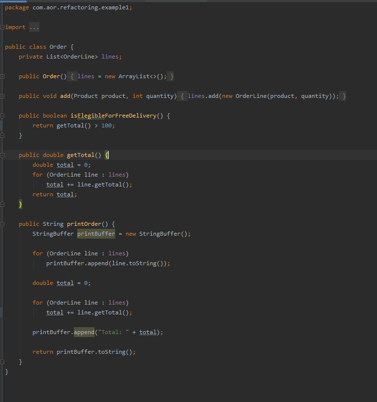
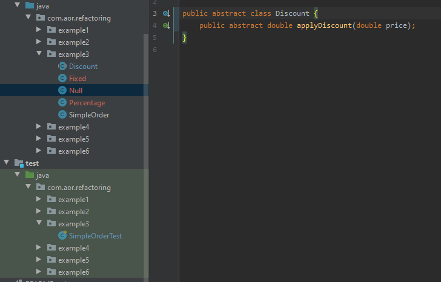

# Exercise 1

## Code Smell (Order): 
+ Duplicate code - _Two code fragments look almost identical._
  
## Refactoring: 
+ Extract Method - _You have a code fragment that can be grouped together._
+ Inline Method - _When a method body is more obvious than the method itself._

## Code Smell (Order Line):
+ Inappropriate Intimacy - _One class uses the internal fields and methods of another class._

## Refactoring:
+ Encapsulate Field - _You have a public field._

## Code Smell (Order Line):
+ Lazy Class - _Classes that don't do much_

## Code Smell (Order):
+ Feature Envy (de Order Line) - _A method accesses the data of another object more than its own data._

## Solution:
+ _Uma OrderLine devia saber imprimir-se a si própria... Ou pelo menos retornar uma representação dela enquanto string_
+ toString() method

## Final Class Order:


_______________________________________

# Exercise 2

## Code Smell (Related to Shape Generalization):
+ Divergent Change - _ Changing many unrelated methods when you make changes to a class._

## Refactoring:
+ Extract Subclass - _ A class has features that are used only in certain cases._

## Code Smell:
+ Switch Statements -  _Complex switch/if operators_

## Refactoring:
+ Replace Conditional with Polymorphism - _You have a conditional that performs various actions depending on object type or properties._

_______________________________________

# Exercise 3

## Code Smell:
+ Divergent Change - _ Changing many unrelated methods when you make changes to a class._

## Code Smell:
+ Switch Statements -  _Complex switch/if operators_

## Refactoring:
+ Replace Conditional with Polymorphism - _You have a conditional that performs various actions depending on object type or properties._

## Final Class Discount:


_______________________________________

# Exercise 4

## Code Smell:
+ Refused Bequest - _If a subclass uses only some of the methods and properties inherited from its parents._

## Refactoring:
+  Criação de uma nova classe Persond e onde são herdados o ````name```` e o ````phone````

_______________________________________

# Exercise 5

## Code Smell:
+ Nested If's

## Refactoring:
+ Replace Type Code with Class - _ A class has a field that contains type code. The values of this type are not used in operator conditions and do not affect the behavior of the program._


