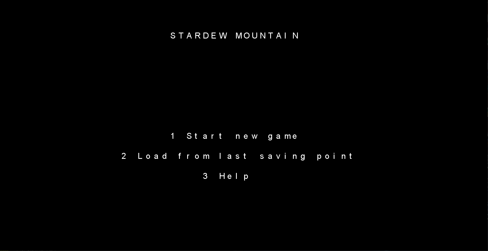
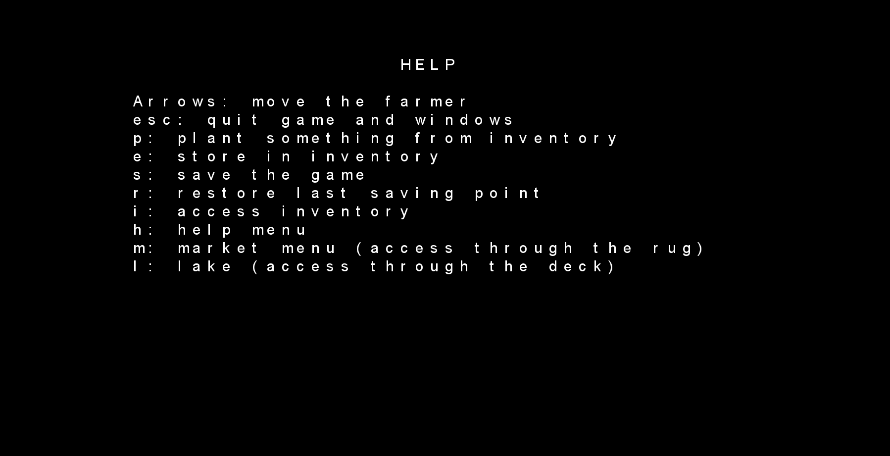
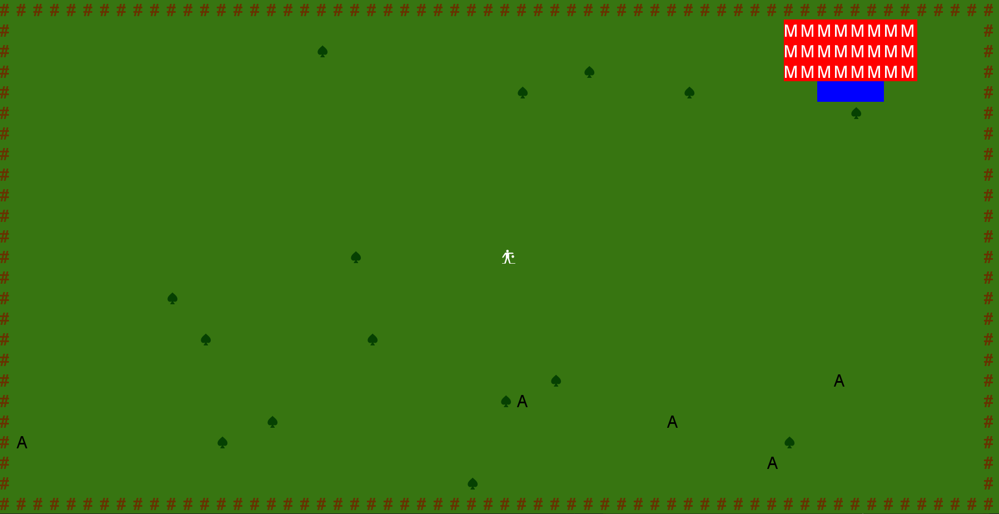
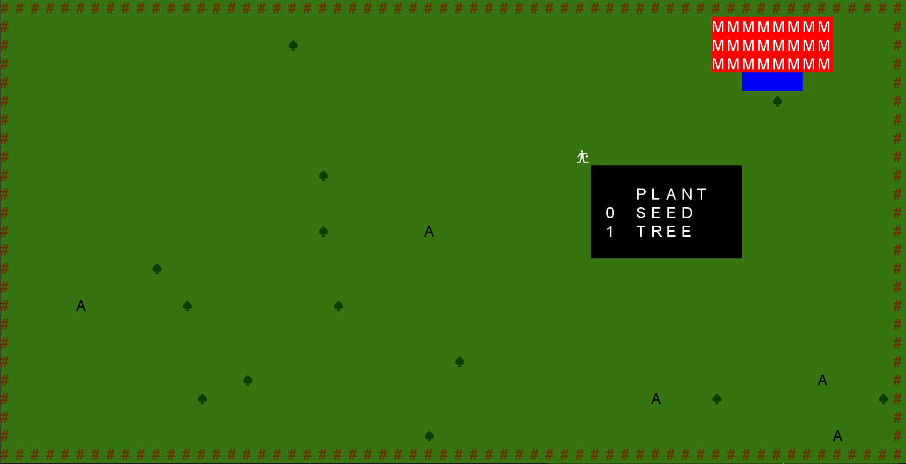
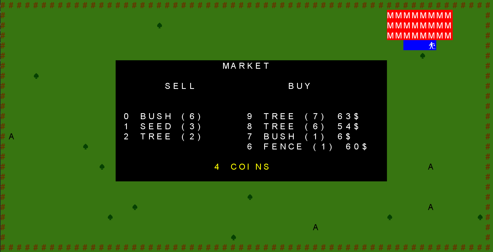
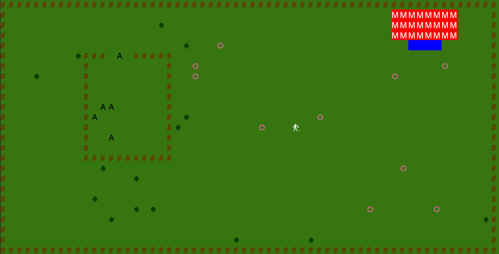
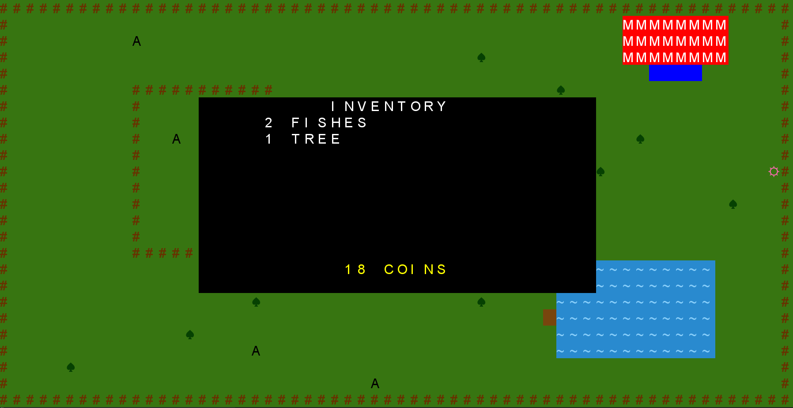
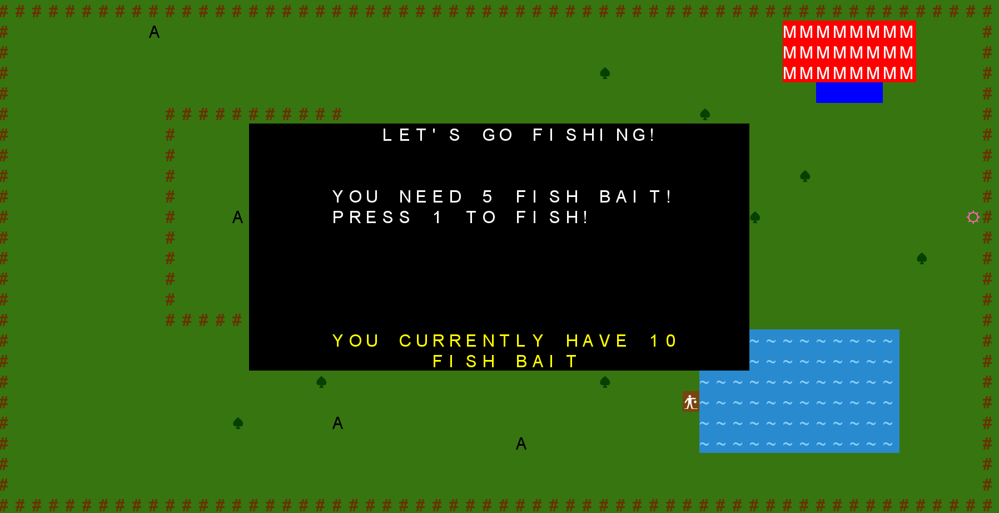
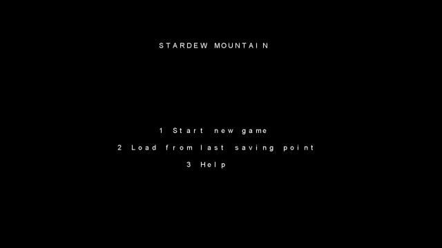

# LPOO_T2_G3 - Stardew Mountain

**Welcome to the countryside!** 

In this *Stardew Mountain* inspired game the goal is simple: have fun and groom the best farm you possibly can!
The farm itself involves various aspects of farmland management, such as plowing land, planting, growing, and harvesting crops, harvesting trees and raising livestock.

This project was developed by Alexandra Ferreira (up201806784@fe.up.pt) and Beatriz Mendes (up201806551@fe.up.pt) for LPOO 2018⁄19.

