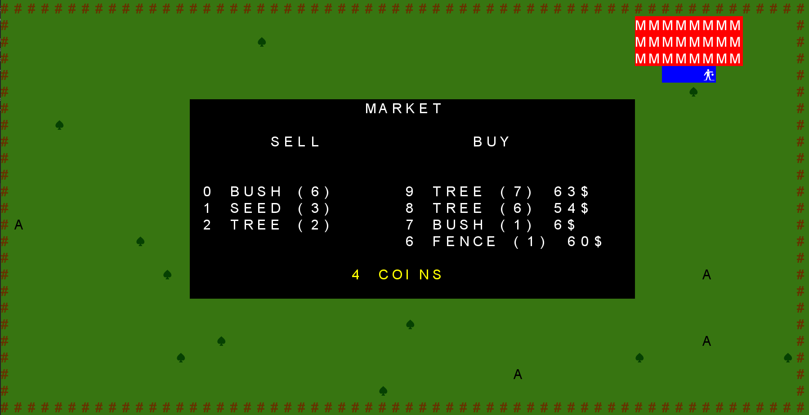
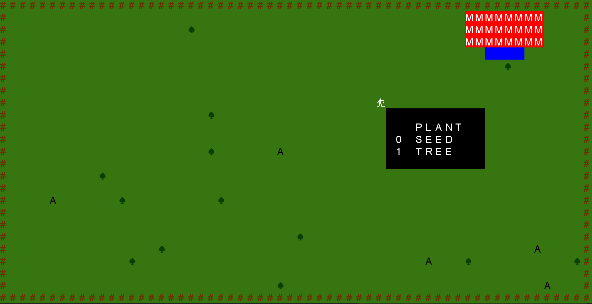
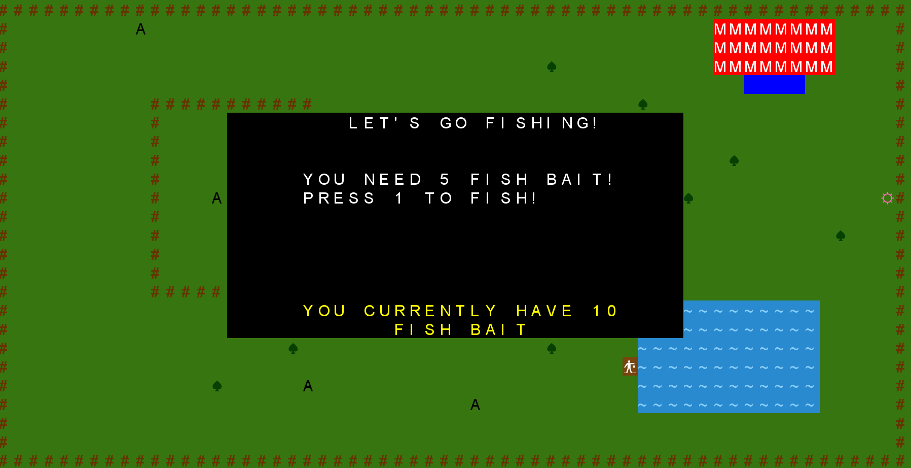

# LPOO_T2_G3 - Stardew Mountain

**Welcome to the countryside!** 

In this *Stardew Mountain* inspired game the goal is simple: have fun and groom the best farm you possibly can!
The game itself involves various aspects of farmland management, such as plowing land, planting, growing, harvesting crops and raising livestock.

This project was developed by Alexandra Ferreira (up201806784@fe.up.pt) and Beatriz Mendes (up201806551@fe.up.pt) for LPOO 2019⁄20.


## IMPLEMENTED FEATURES

+ **Moving Farmer**: use the arrow keys to move the farmer in the farm;
+ **Harvesting Action**: use the key "e" to harvest object from the farm and store them in the farmer's inventory;
+ **Plant something from inventory**: use the key "p" to plant trees, bushes, seeds or fences that are stored in the farmer's inventory;
+ **Inventory**: the inventory is organized alphabetically and shows the number of items of each category; the inventory has a finite capacity;
+ **Animals**: animals are present in the farm and move on their own;
+ **Notion of Time**: the seeds will grow into bushes and the bushes into trees after some time (this was implemented using a counter, each time 
the farmer moves or some action occurs, the counter is incremented by 1), other special features happen in set intervals;
+ **Game Memory**: the game data can be stored pressing the key "s" and restored by pressing the key "r", when starting a new game, you can always load the previous game played;
+ **Help**: by pressing the key "h" the player has access to all active commands of the game;
+ **Farmer's Market**: the farmer has access to a farmer's market, where he's able to sell the goods he has stored in his inventory and buy some randomly selected items as well (that are renewed regularly); this allows him to make a profit and unlock special items!
+ **Special and Unique Upgrades**: there are specials items available at the Market; after one is bought, another is unlocked and with it some additional features (like surprise gifts and the ability to go fishing!).  

Here's some screenshots of the most important features implemented: shopping, panting and upgrades (in this case, the fishing upgrade).








## PLANNED FEATURES

+ **Graphics**: as of now, the graphics used are extremely simple, we would like our program to be *unicode*-based in order to boost its aesthetic value and make it more appealing;

## DESIGN

### **Messy code organisation**

**Problem in Context**

While developing our game, we noticed that some of our classes were doing a lot of different things that weren't related like getting commands from the keyboard and drawing the farm.

**The Pattern**

We've decided to use the **MVC Pattern**. THe **MVC** (Model - View - Controller) is an architectural pattern used to divide an application into 3 parts.

1. The *model* represents the data.
2. The *view* displays the model's data.
3. The *controller* handles user actions, works with both the model and the view.

**The Implementation**

We separated our code into 3 big modules.


**Consequences**

This separation of modules helped us better manage the complexity of the application, because it enabled us to focus on one aspect of its implementation at a time.
It also promoted high cohesion and low coupling. All of this making it easier to modify our code while implementing new features.

### **Too many booleans to check the current state of the game**

**Problem in Context**

We had to many booleans defining the states of the game and what objects should be shown along with what actions should be allowed.

**The Pattern**

To eliminate this problem, we decided to implement a state machine using the **State Pattern**. The following diagram represents the state machine implemented along with the keys that have to be pressed to switch states.


The **State Pattern** allows an object to alter its behaviour when its internal state changes. 

This pattern is useful because, by creating classes that implement an *interface* **State**, and setting them, we can verify the state the game is at and decide what actions to allow accordingly and what to draw on the screen.

**The Implementation**


We created an interface **State** that has 2 methods: *doAction*, that deals with the current state and *getName*, that returns a string with the name of the current state (used while testing and debugging).

````java
public interface State {
    void doAction(FarmController farmController) throws IOException;
    String getName();
}
````

The other state-related classes implement this interface and execute a certain command, that is explained in the **Command Pattern** section.

As an example, let's look at the **FishingState** *class*: 
```java
public class FishingState implements State{
    (...)
    public FishingState(FarmController farmController) {
        this.farmController = farmController;
        this.command = new FishingCommand(farmController);
    }

    @Override
    public void doAction(FarmController farmController) throws IOException { command.execute(); }

    @Override
    public String getName() { return "Fishing"; }
}
```
When this State is instantiated, its constructor automatically sets the current command to the **FishingCommand**. All the **doAction** function has to do then is call `command.execute();`.

The state is then altered inside the command's **execute()** function. 
To continue with the ongoing example, when the **FishingCommand**'s **execute()** function is called, it checks the state of the game, and, if no problems are found, lets the player fish!
```java
@Override
    public void execute() throws IOException {
        if(farmController.getState() instanceof GameState) 
            farmController.setState(new FishingState(farmController)); // accesses the fishing lake if the player was previously on the farm
        else{
            (...)
            if (option == -1) farmController.setState(new GameState(farmController)); // exits the fishing lake, sets the state of the game back
            else if (option == 1) farmController.getFarmModel().fish(); // if the coice if valid, the player goes fishing!
        }
    }
```

Our main function only needs to call the current state's **doAction()** function: 
```java
public void run() throws IOException {
        while (true) {
            farmView.drawGame(farmModel, state); // the drawGame function also checks the state of the game, in order to know what needs to be drawn on screen
            state.doAction(this);
            if(this.state instanceof QuitState) break;
        }
    }
```

**Consequences**

By implementing this pattern, we were able to reduce the number of variables and methods of the **FarmController** class.
Now, our game’s behavior is the result of the function of its state, and the behavior gets changed at runtime depending on the state. 
This removes the dependency we previously had on the switch/case conditional logic. It also improves cohesion.

### **Numerous commands and long repetitive functions**

**Problem in Context**

We had an extensive list of commands representing each possible action. 

`public enum COMMAND {UP, RIGHT, DOWN, LEFT, QUIT, ACTION, INVENTORY, SAVE, RESTORE, HELP, PLANT, MARKET, LAKE, FISH};`

Therefore, we always had to check which command was returned before deciding which function to call. This resulted in 2 lengthy functions whose predominant focuses were identifying the desired command and acting accordingly.

*receiving a command*
```java
public COMMAND getCommand(){
        while (true) {
            KeyStroke key = screen.readInput();
            if (key.getKeyType() == KeyType.ArrowUp) return COMMAND.UP;
            if (key.getKeyType() == KeyType.ArrowRight) return COMMAND.RIGHT;
                (...)
        }
    }
```
*delegating responsibilities*
```java
public void run(Farm farm) {
    (...)
    Command command = getCommand();
    if (command == COMMAND.UP)
        farm.moveObject(farm.getFarmer().moveUp(), farm.getFarmer());
    if (command == COMMAND.RIGHT)
        farm.moveObject(farm.getFarmer().moveRight(), farm.getFarmer())
    (...)
}
```

**The Pattern**

The **Command** Pattern is a behavioral design pattern that turns a request into a stand-alone object that contains all the information about the request in question. 

**The Implementation**


We created an interface *Command* that was implemented by every Command we needed afterwards.
```java
public interface Command {
    void execute() throws IOException;
}
```
Each class that implements this interface has its specific *Override* definition of the *execute()* function. 
As an example, take the *UpCommand* class, whose sole function is to move the farmer up on the game board (when the *Arrow Up* key is pressed). Its *execute* function looks like :
```java
@Override
public void execute() {
    farmModel.moveObject(farmModel.getFarmer().moveUp(), farmModel.getFarmer());
}
```
After the application of this pattern, the succession of *if clauses* in the *run()* function was replaced by 1 line of code:
```java
Command command = getCommand();
command.execute();
``` 

**Consequences**

As a result, our code became more extensible; as we could add new commands without changing existing code. It also made it so it was easier to read and control since each command became a separate whole object with a distinct and specialized function.

### **We should be able to save the game and restore it when desired (during runtime and when we exit the game)**

**Problem in Context**

We would like it if it were possible to save the state of the game whenever desired, so that, if the player wants to undo some play he has made 
or simply exit the game and return to the previous state, he could. However we had no way of doing so. 

**The Pattern**

In order to solve this problem, we used the **Memento Pattern**. This pattern consists in capturing and externalizing an object's internal state so that the object can be returned to this same state later on.

The Memento design pattern defines three distinct roles:
1.	Originator - the object that knows how to save itself.
2.	Caretaker - the object that knows why and when the Originator needs to save and restore itself.
3.	Memento - the lock box that is written and read by the Originator, and shepherded by the Caretaker.

**The Implementation**


We created a new class, **FarmMemento** whose only attribute is a *String* named *state*. 
It also only contains 3 methods:  2 constructors and a get method that return the *state*. 

**NB**:This class' sole purpose is to store the Farm's state, but in order to avoid confusion with the classes related to the **State Pattern**, we've decided to call these classes ***Class*****Memento** instead of ***Class*****State**.

```java
public class FarmMemento {
    private String state;
    public FarmState(int width, int height, int timeCounter, Farmer farmer,
                         List<Tree> trees, List<Fence> fences, Inventory inventory,
                         List<Animal> animals, List<Seed> seeds,
                         List<Bush> bushes, List<Flower> flower){}
    public FarmState(String state) {}
    public String getState() {}
}
```
This is the class that knows how to save the data; the first constructor receives every attribute of the **FarmModel** *class*.
What it does is store all the information given in the parameters into the *String* **state**.
Here's a sample:
```java
// storing the data relating to the animals
    StringBuilder s7 = new StringBuilder("\n::::::::::\nANIMALS");
    for (Animal animal : animals) {
        elementState = new ElementState(animal.getPos());
        s7.append("\n").append(elementState.getState());
    }
```
At the end of this constructor method, every *StringBuild* **snº** containing the state of every object will be concatenated, resulting in a complete **state** attribute.

The **FarmModel** class then has two functions:
* The **save** function returns a **FarmMemento** object containing the current memento of the farm.
```java
    public FarmMemento save() {
       return new FarmState(this.width, this.height, this.timeCounter,
                  this.farmer, this.trees, this.fences, this.inventory,
                  this.animals, this.seeds, this.bushes, this.flowers);
       }
   ```
The **FarmModel** *class* can now safe itself! By doing something like `farmModel.save()` we would get a **FarmMemento** object containing all the information of the *farmModel* at that precise moment.

* The **restore** function is a void function that sets all of the **Farm** attributes back to the *state* saved in the *farmMemento* parameter.
```java
    public void restore(FarmState farmState){
        String[] arr = farmState.getState().split("\n::::::::::\n");
    
        this.width = Integer.parseInt(arr[0]);
        this.height = Integer.parseInt(arr[1]);
        this.timeCounter = Integer.parseInt(arr[2]);
        this.farmer.restore(new FarmerState(arr[3]));
        (...)
}
   ```
Every object of the **FarmModel** class is separated by a *String* `"\n::::::::::\n"` in its **FarmMemento** counterpart.

**Consequences**

Every time the player presses the "s" key, the game is saved. Whenever the "r" key is pressed, the game is restored to its previous saved state. 
We've also implemented the use of files, hence allowing the game's information to be stored and recovered even after the program has ended. 
The game automatically saves before exiting. Allowing every player to continue the last game played.


### **Needing to check which subclass of Plant we're dealing with before instantiating an object**

**Problem in Context**

There are functions in our code that require the creation of an object of the abstract class **PlantModel**; this means we need to know beforehand which sub-class we want to instantiate.
We would then be faced with big "chunks" of code in which we checked each possible option before generating the plant (using the specific construct, `new TreeModel()` for example).

**The Pattern**

The **Factory Pattern** ensures that the *Open-Closed* principle is respected. Defines a method for creating an object but lets subclasses decide which class to instantiate.
It acts as a virtual constructor.

**The Implementation**


We have our *abstract class* **PlantModel** from which each *plant* is extended.

We then created a new class, **PlantFactory** whose only attribute is an *enumerated type* named **plant**. 
This *enum* type contains every possible subclass of **PlantModel** `{TREE, BUSH, SEED, FLOWER};`
 
It also only contains a single method: 1 constructor for an object of the **Plant** class.
 
 ```java
 public Plant getPlant(PLANT plant) {
           if(plant == PLANT.TREE) return new TreeModel();
           if(plant == PLANT.BUSH) return new BushModel();
           if(plant == PLANT.SEED) return new SeedModel();
           if(plant == PLANT.FLOWER) return new FlowerModel();
           return null;
       }
``` 

To understand its reasoning, we'll be using a concrete example:

A **gift** is something that is given to the **Farmer** and its contents added to the **Inventory**.
They can be a series of different objects; including any **Plant** (**Seed**, **Bush**, **Tree** and **Flower**). 
By knowing that a specific gift is a **Plant**, we would need to check which plant before being able to instantiate the correct one.
This could be done by using a chain of *switch/case* logic. However, by having a factory method, we could delegate the choice to this class. 

*before*
```java
switch (plant) {
    case TREE:
        addInventory(new TreeModel());
        break;
    case FLOWER:
        addInventory(new FlowerModel());
        break;
    case SEED:
        addInventory(new SeedModel());
        break;
    case BUSH:
        addInventory(new BushModel());
        break;
}
```
*after*
```java
PlantFactory plantFactory = new PlantFactory();
addInventory(plantFactory.getPlant(plant));
```

**Consequences**

As a consequence, we have a much shorter, less prone to errors function. It is a more adaptable code, since it automatically instantiates the class it needs, instead of having to check beforehand.
Our code also became more extensible; we can easily add or remove new **PlantModel**s without changing the existing code.


## KNOWN CODE SMELLS AND REFACTORING SUGGESTIONS

### 1. The way we order and print the objects from the inventory could be ***A LOT*** better
   + **Problem**: The code is very extensive because we check the amount of everything in the inventory and then print accordingly (only printing those that have 1 or more entities present and in alphabetical order).
   + **Solution**: We've created some auxiliary functions that are used all throughout the game! 
   
   The first and most important one would be `public HashMap<String, Integer> indexSelection(boolean all)` from the **Inventory** *class*. This function returns a **HashMap** containing a pair *String*-*Integer*; the *String* 
   represents the object in the inventory ("TREE", "SEED", ...) and the *Integer* acts as an index. If no entities as present in the inventory, its respective index is -1 otherwise they could go from 0 to 4, ordering the 
   objects in alphabetical order. (Therefore no *values* in the **HashMap** are repeated except for -1). The *boolean* **all** allows us to control which elements we want information about (all or only plantable elements). 
   
   The second function created is `private String keyFromValue(HashMap<String, Integer> map, int value)` that simply returns the *key* of a **HashMap** when given a *value*.
   
   *before*
````java
private void InventoryPrintPosition(TextGraphics graphics, Farm farm){
        if(farm.getInventory().getElements().size() == 0) {
            graphics.putString(farm.getWidth()/4 + 5, farm.getHeight()/4 + 1, "EMPTY!");
        }
        else{
            if(farm.getInventory().getBushes() != 0){
                InventorySingularOrPlural(graphics, farm, new Bush(), farm.getInventory().getBushes(), 1);
                if(farm.getInventory().getSeeds() != 0){
                    InventorySingularOrPlural(graphics, farm, new Seed(), farm.getInventory().getSeeds(), 3);
                    if(farm.getInventory().getTrees() != 0)
                        InventorySingularOrPlural(graphics, farm, new Tree(), farm.getInventory().getTrees(), 5);
                }
                else{
                    (...)
                }
            }
            else{
                (...)
            }
        }
    }
````

*after*
```java
private void printPositions(TextGraphics graphics, FarmModel farmModel) {
        HashMap<String, Integer> map = farmModel.getInventory().indexSelection(true);
        String string = "";

        for (int i = 0; i < 6; i++) { // we only want elements whose indexes are >=0
            if (map.containsValue(i)) {
                string = keyFromValue(map, i);
                InventorySingularOrPlural(graphics, farmModel, string, i);
            }
        }
    }
```

### 2. Numerous commands for similar actions
   + **Problem**: we have too many commands for akin actions (for example, we have a command to plant trees, a command to plant bushes and a command to plant seeds)
   + **Solution**: a command to plant that creates a small menu to decide what we want to plant according to what's available in the inventory.

*before* 
```java
//receiving the command
if (key.getKeyType() == KeyType.Character && key.getCharacter() == 't') return COMMAND.PLANT_TREE;
if (key.getKeyType() == KeyType.Character && key.getCharacter() == 's') return COMMAND.PLANT_SEED;
if (key.getKeyType() == KeyType.Character && key.getCharacter() == 'b') return COMMAND.PLANT_BUSH;
```
```java
//executing it
if (command == COMMAND.PLANT_TREE)
    farm.removeFromInventory(new Tree());
if (command == COMMAND.PLANT_SEED)
    farm.removeFromInventory(new Seed());
if (command == COMMAND.PLANT_BUSH)
    farm.removeFromInventory(new Bush());
```
*after*
```java
//receiving the command
if (key.getKeyType() == KeyType.Character && (key.getCharacter() == 'p' || key.getCharacter() == 'P')) return new PlantCommand(this);
```
```java
//executing it 
command.execute(); 
```
Where the *execute()* function looks something like:

*pseudocode*
```java
public void execute() throws IOException {
    if (inventory.getPlants() != 0) {
        choice = farmController.getNumber();
        objectManagement.plant(farmModel, choice); // plant function removes object from the inventory according to choice / availability
    }
    else farmController.setState(new GameState(farmController)); //if there aren't any plantable items in the inventory, Plant menu selection won't even appear
}
```

### 3. addElement(Element element) - lengthy  and repetitive
   + **Problem**: the function is repetitive but depends of the element that we are analyzing and the positions available for planting
   + **Solution**: We created an auxiliary function `public Position nextPossiblePosition()` 
   that returns a **Position** next to the farmer if one is available (if there is none, it would `return new Position(-1,-1);` We also created an *interface* **Plantable** that is only implemented by plantable **Elements** such as **Plants** and **Fences**.
   This *interface* then has a method `void addElement(FarmModel farmModel, PositionModel position);` that is overriden by each Plantable Element. This solution is similar to the **Strategy Pattern** implementation, but simpler since we don't need a 
   **Context** *class* who then calls on the abstract function from its *strategy* attribute.
  
  *before*
````java
public boolean addElement(Element element) {
    if(element instanceof Tree) {
        if(canObjectMove(farmer.moveRight())) {
            ((Tree) element).setPos(farmer.moveRight());
            trees.add((Tree) element);
            timeUpdate();
            return true;
        }
        else if(canObjectMove(farmer.moveLeft())) {
            ((Tree) element).setPos(farmer.moveLeft());
            trees.add((Tree) element);
            timeUpdate();
            return true;
        }
        else if(canObjectMove(farmer.moveUp())) {
            (...)
        }
        else if(canObjectMove(farmer.moveDown())) {
            (...)
        }
    }
    else if(element instanceof Seed) {
        if(canObjectMove(farmer.moveRight())) {
            (...)
        }
        (...)
    }
    else if(element instanceof Bush) {
        (...)
    }
    return false;
}
````

*after*
```java
public boolean addElement(Plantable plantable) {
        PositionModel position = movement.nextPossiblePosition(this,true);
        if(position.equals(new PositionModel(-1,-1))) return false;
        else {
            plantable.addElement(this,position);
            time.timeCheck(this);
            return true;
        }
    }
```

### 4. Similar Generator functions that return a List of different *class* objects
   + **Problem**:  When the game is initialized, a series of random generators are called to add elements to the Farm. They vary in the number of objects created, the *class* of said objects and on wether their positions are random or not (some may attribute random positions on particular occasions only).
   + **Solution**: We created an *interface* **RandomGenerator** that contains a single method `List<?> generate(FarmModel fm, int num);` Every class that implements this *interface*, overrides the method, choosing what kind of 
   List they want to return and defining the body of the function.

*before*

The constructor method for the **FarmModel** *class* generated some of its attributes like this:
````java
this.trees = createTrees();
this.fences = createFences();
this.animals = createAnimals();
````
Where each *createObject()* function was a distinct function defined in the **FarmModel** *class*, used only once. Every time we wanted to generated new Trees or new Animals we had to redo the function.

*after*
````java
this.trees = (new GenerateTree()).generate(this,15);
this.fences = (new GenerateFence(true)).generate(this,60);
this.animals = (new GenerateAnimal(true)).generate(this,5);
````

5. Useless attributes that could be replaced by a single counter attribute
   + **Problem**:  We have many booleans involving the upgrade functions (they are set to `true` once an upgrade has been purchased)
   + **Solution**: Creating a variable that is incremented throughout the program (we can only buy an upgrade if the previous one has been acquired)

*before*
````java
private int currentUpgrade;
private boolean upgrade1;
private boolean upgrade2;
private boolean upgrade3;
(...)
````

*after*
````java
private int upgradeCounter;
````
## TESTING

A large portion of our game relies on **Elements** being generated and moving randomly, making them sometimes hard to test.
This also causes some tests to fail on rare occasions.

### Coverage


### Mutation Tests


## SELF-EVALUATION

The workload for this project was divided evenly between us!
